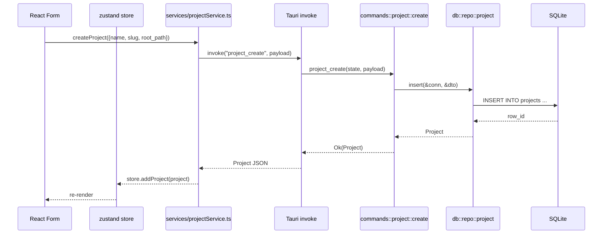

# QuietMem Phase 1 アーキテクチャ

## 概要

QuietMem は Tauri (Rust) をバックエンド、React (TypeScript / Vite) をフロントエンドとするローカルファーストのデスクトップアプリである。Phase 1 ではプロジェクト土台 / DB 層 / Tauri commands / Workspace Shell UI を構築し、Project・Agent・Worktree の最小 CRUD を成立させる。

## 仕様からの対応

- spec.md §1 目的 全体
- spec.md §2.1 / 2.2 / 2.3 スコープ全体
- spec.md §7 技術前提

## レイヤ構成

```
+----------------------------------------------------------+
|                    UI Layer (React)                      |
|  - Workspace Shell / Pages / Forms / Design tokens       |
|  - State store (zustand)                                 |
+----------------------------------------------------------+
|          Frontend Service Layer (TypeScript)             |
|  - Tauri invoke ラッパー (src/services/*.ts)             |
|  - 型定義 (src/types/bindings.ts)                        |
+----------------------------------------------------------+
                |  Tauri IPC (invoke)  |
+----------------------------------------------------------+
|            Tauri Command Layer (Rust)                    |
|  - src-tauri/src/commands/*.rs                           |
|  - 引数バリデーション / DTO 変換 / エラーマッピング      |
+----------------------------------------------------------+
|              Repository Layer (Rust)                     |
|  - src-tauri/src/db/repo/*.rs                            |
|  - rusqlite ベース、トランザクション制御                  |
+----------------------------------------------------------+
|                SQLite + Local Files                      |
|  - AppData/QuietMem/db/quietmem.sqlite                   |
|  - AppData/QuietMem/projects/<id>/...                    |
+----------------------------------------------------------+
```

## Tauri ↔ Frontend 境界

- 境界は Tauri commands のみとする。`window.__TAURI__` の直接利用や raw IPC は禁止。
- Rust 側は `commands::*` モジュールに `#[tauri::command]` を定義し、`thiserror` ベースの `AppError` を返す。
- Frontend 側は `src/services/` に 1 ドメイン 1 ファイルで invoke ラッパーを配置し、常に型付き Promise を返す。
- 型定義は Rust の入出力構造体を単一真実とし、対応する TypeScript 型を `src/types/bindings.ts` に手書きでミラーする (Phase 1 では ts-rs 等を導入しない)。

## データフロー例 (Project 作成)



## ディレクトリ構成 (リポジトリルート)

```
quietmem/
├─ src-tauri/                 # Tauri + Rust バックエンド
│  ├─ Cargo.toml
│  ├─ tauri.conf.json
│  ├─ build.rs
│  └─ src/
│     ├─ main.rs              # エントリポイント
│     ├─ lib.rs               # run() 関数
│     ├─ app_state.rs         # 共有 AppState (DB Pool 等)
│     ├─ error.rs             # AppError 定義
│     ├─ paths.rs             # ローカルファイル保存先規約
│     ├─ db/
│     │  ├─ mod.rs
│     │  ├─ connection.rs     # rusqlite 接続ラッパ
│     │  ├─ migration.rs      # マイグレーション runner
│     │  ├─ migrations/
│     │  │  └─ 001_init.sql
│     │  └─ repo/
│     │     ├─ mod.rs
│     │     ├─ project.rs
│     │     ├─ agent.rs
│     │     └─ worktree.rs
│     └─ commands/
│        ├─ mod.rs
│        ├─ project.rs
│        ├─ agent.rs
│        └─ worktree.rs
├─ src/                       # React フロントエンド
│  ├─ main.tsx
│  ├─ App.tsx
│  ├─ routes/                 # 画面ルーティング
│  │  ├─ WorkspaceRoute.tsx
│  │  ├─ DashboardRoute.tsx
│  │  ├─ SettingsRoute.tsx
│  │  └─ FirstRunRoute.tsx
│  ├─ shell/                  # Workspace Shell 領域
│  │  ├─ Header.tsx
│  │  ├─ LeftSidebar.tsx
│  │  ├─ MainTabs.tsx
│  │  ├─ RightPanel.tsx
│  │  └─ BottomDrawer.tsx
│  ├─ tabs/
│  │  ├─ OverviewTab.tsx
│  │  ├─ EditorTab.tsx
│  │  ├─ MemoryTab.tsx
│  │  ├─ RunsTab.tsx
│  │  └─ CronTab.tsx
│  ├─ features/
│  │  ├─ projects/
│  │  │  ├─ ProjectList.tsx
│  │  │  └─ ProjectCreateForm.tsx
│  │  ├─ agents/
│  │  │  ├─ AgentList.tsx
│  │  │  ├─ AgentCreateForm.tsx
│  │  │  └─ AgentEditForm.tsx
│  │  └─ worktrees/
│  │     ├─ WorktreeList.tsx
│  │     └─ WorktreeCreateForm.tsx
│  ├─ services/
│  │  ├─ projectService.ts
│  │  ├─ agentService.ts
│  │  └─ worktreeService.ts
│  ├─ store/
│  │  ├─ projectStore.ts
│  │  ├─ agentStore.ts
│  │  └─ uiStore.ts
│  ├─ types/
│  │  └─ bindings.ts          # Rust ↔ TS 型の手動ミラー
│  └─ styles/
│     ├─ tokens.css           # デザイントークン (CSS variables)
│     └─ global.css
├─ index.html
├─ package.json
├─ pnpm-workspace.yaml (任意)
├─ tsconfig.json
├─ vite.config.ts
└─ agent-docs/                # 詳細設計ドキュメント (本フォルダ)
```

## 起動シーケンス

1. `main()` → `tauri::Builder` 組み立て
2. `setup` フックで以下を順に実行
   1. `paths::init()` で AppData ルートと必須サブディレクトリを保証
   2. `db::connection::open()` で SQLite 接続を確立 (WAL モード)
   3. `db::migration::run_pending()` で `001_init.sql` を適用
   4. `AppState` を `tauri::manage()` 登録
3. フロントエンドは `App.tsx` でルートを決定
   - `project.list` を 1 度呼ぶ
   - 0 件なら `FirstRunRoute` へ
   - 1 件以上なら `WorkspaceRoute` へ

## 制約・注意事項

- Phase 1 では DB アクセスの並列化は不要。`Mutex<Connection>` を AppState に 1 つ保持する最小構成で十分。
- エラーは `AppError` に集約し、`Serialize` 実装で `{code, message}` の固定フォーマットにする。
- フロントエンドからの invoke は必ず services 層経由にし、コンポーネントから直接 `invoke` しない。
- Workspace Shell は絶対位置レイアウトではなく CSS Grid / Flex で構成し、リサイズ耐性を持たせる。
